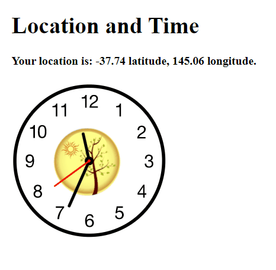

# JavaScript Mini Projects

## ℹ About
Building small projects with while learning React fundamentals.

## 🎥 Overview of Projects
### 1. Star wars
Understanding the relationship between JS and JSX.
Looping through an array of StarWars characters and rendering information.

### 2. Clock
Practising lifecycle methods and setState. Geolocation current position API call.
Clock that shows ticking seconds hand and an image for the season based on the month and hemisphere.

