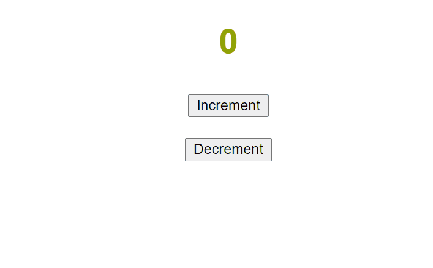

# JavaScript Mini Projects

## ℹ About

Building small projects with while learning React fundamentals.

## 🎥 Overview of Projects

### 1. Star wars

Understanding the relationship between JS and JSX.
Looping through an array of StarWars characters and rendering information.

### 2. Clock

Practising lifecycle methods and setState. Geolocation current position API call.
Clock that shows ticking seconds hand and an image for the season based on the month and hemisphere.

### 3. Counter

Practising state, useEffect with setInterval and setTimeout.
Counter that autoincrements every second and changes color. Increment and Decrement buttons.

